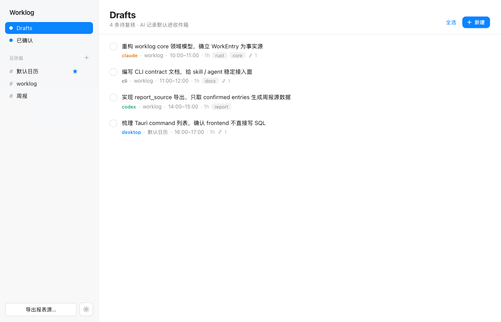
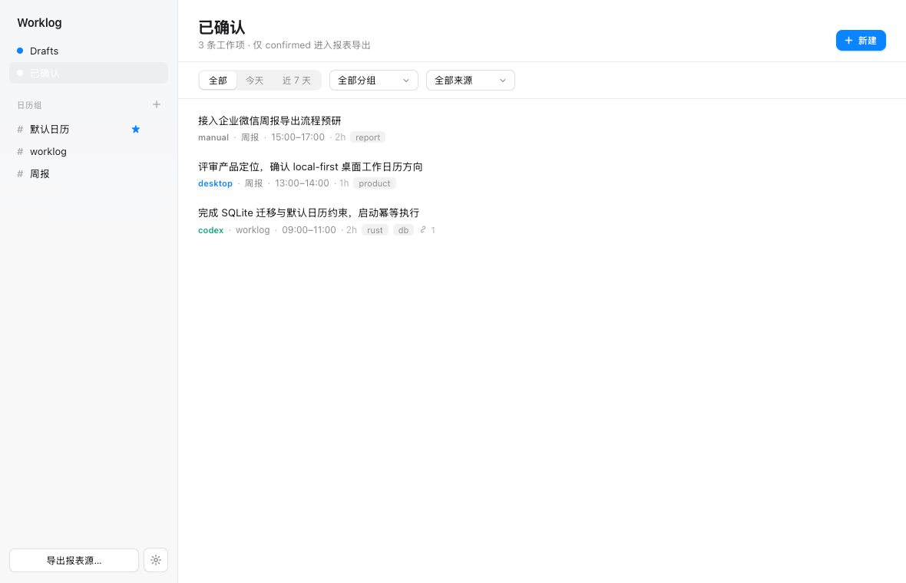
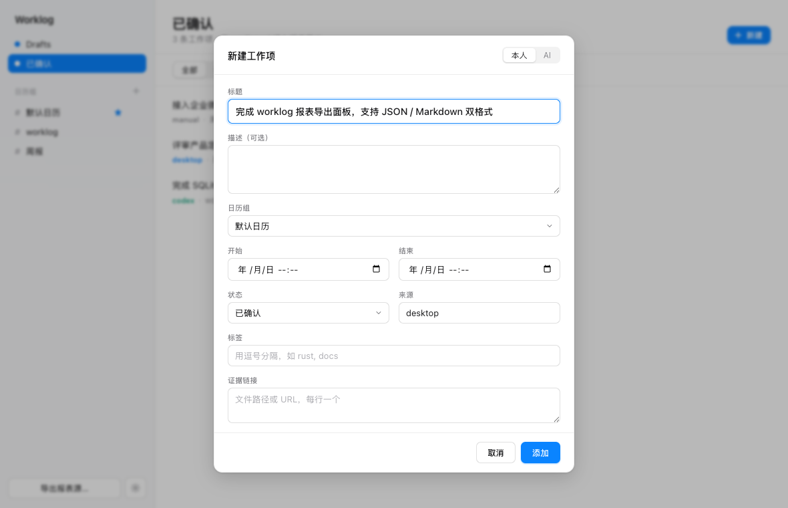
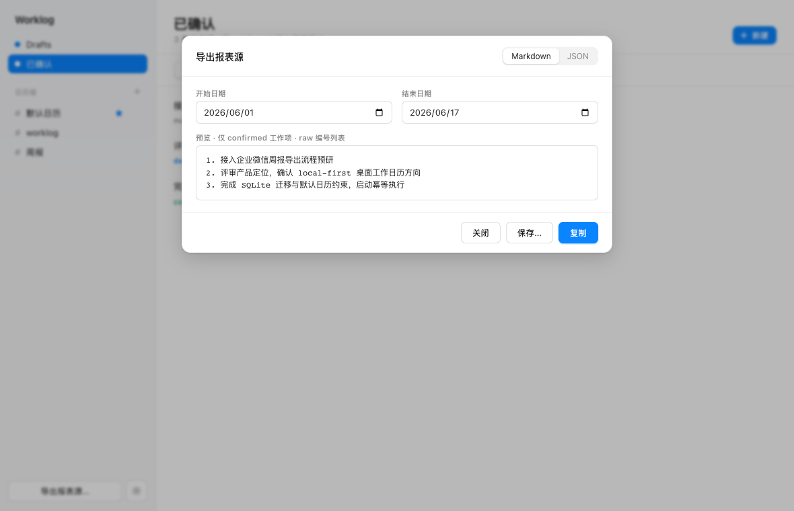
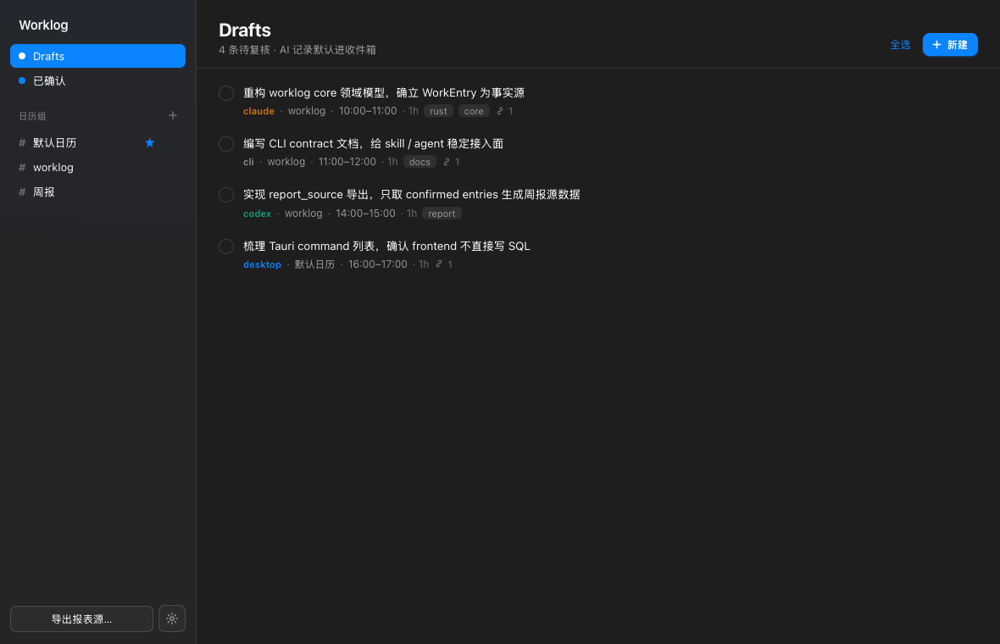

# awl

> **awl** = **A**I **W**ork **L**og。AI-native 本地工作台账：让 skill、CLI、AI agent 和人都能把"做了什么、产生了什么结果、有什么价值"写进本地 SQLite，在桌面端复核确认，再导出成周报/月报源数据。

**本地优先 · 不上传任何数据 · CLI + 桌面共用一个库。**



> 注：项目名为 **awl**（AI Work Log）。当前 CLI 命令与 crate 仍沿用 `worklog`，后续会统一改名为 `awl`。

---

## 为什么做这个

越来越多的工作由 AI agent、coding assistant 和本地工具完成。它们产出的工作记录很有价值，但通常散落在聊天记录、终端输出、提交历史和临时笔记里，到了写周报/月报时又得回忆和拼凑。

`awl` 把这些产出沉淀成一个**本地、可复核、可汇总**的工作台账：

1. **AI 提议** —— skill / agent 把一段工作总结成一条「动作 + 结果 + 价值」，默认写成 `draft`。
2. **人确认** —— 在桌面端复核收件箱，确认 / 编辑 / 归档。
3. **导出源数据** —— 把 `confirmed` 工作项按时间范围导出（JSON / 纯编号 Markdown），交给 AI 合并改写成周报。

这不是通用日历 App。核心对象是 `WorkEntry`；日历组只是本地分组，外部日历同步是未来的投影。

> 起源：本项目从两个个人 skill 原型（`log-work` 写企业微信 `oa ` 日历、`write-oa-weekly-report` 靠 `organizer==null` 过滤生成周报）重构而来，摆脱了 macOS EventKit / 具名日历 / 平台绑定，改为通用的 local-first 工具。

## 功能

- **WorkEntry 台账** —— 一条记录 = 标题（动作+结果+价值）+ 项目分组 + 起止时间 + 状态 + 来源 + 标签 + 证据链接。
- **Draft / Confirmed 复核流** —— AI 创建的记录默认进 `draft` 收件箱；只有 `confirmed` 才进报表。
- **稳定 CLI** —— `worklog entry / calendar / export`，JSON 输出是 skill / agent 的稳定契约。
- **Tauri 桌面端** —— draft 收件箱、已确认列表、创建/编辑表单、批量确认/归档/删除、日历组增删改查、报表导出面板。
- **报表源导出** —— 按日期范围导出 `confirmed` 工作项的 JSON 或 raw 编号 Markdown。
- **桌面体验** —— 关闭窗口最小化到托盘（macOS 状态栏 / Windows 通知区）、开机自启（macOS / Windows）、明暗主题随系统。
- **配套 skill** —— `skills/` 下的 `log-work`（记录）和 `weekly-report`（生成周报）直接驱动 CLI。

## 界面

<table>
  <tr>
    <td width="50%"></td>
    <td width="50%"></td>
  </tr>
  <tr>
    <td width="50%"></td>
    <td width="50%"></td>
  </tr>
</table>

## 架构

```text
AI skill / agent / shell ──► worklog CLI ──┐
                                           ▼
                                   Rust core + SQLite        ◄── 唯一事实源
                                           ▲
        Tauri desktop ─────────────────────┘
        draft 收件箱 / 列表 / 编辑 / 确认 / 导出

Phase 2: WorkEntry ─► sync projection ─► Google / macOS Calendar / ICS / 企业日历
```

- **`crates/worklog-core`** —— 领域模型 + SQLite 存储 + 仓储 + 报表查询（纯 Rust 库，事实源逻辑都在这里）。
- **`crates/worklog-cli`** —— `worklog` 命令行，AI 集成的稳定入口。
- **`desktop/`** —— Tauri v2 桌面应用（`src-tauri` Rust 后端 + Preact 前端）。

CLI 和桌面都只调用 core，不直接写 SQL；两者默认共用同一个本地 SQLite 库，所以 CLI 写入的工作项会出现在桌面端。架构细节见 [`CLAUDE.md`](./CLAUDE.md)。

## 环境准备

| 组件 | 需要 |
|------|------|
| CLI + core | Rust stable（`rustup`）；一个 C 编译器（bundled SQLite 用）：macOS `xcode-select --install`、Linux `build-essential`、Windows MSVC（VS Build Tools 的 *Desktop development with C++*） |
| 桌面端 | 以上 + Node.js 20+；Tauri 平台依赖：macOS 仅需 Xcode CLT、Linux 需 WebKitGTK（`libwebkit2gtk-4.1-dev` 等）、Windows 需 WebView2 Runtime |

完整 Tauri prerequisites：<https://v2.tauri.app/start/prerequisites/>

## 构建与运行

### CLI / core

```sh
make build          # cargo build --workspace
make test           # cargo test --workspace
make fmt            # cargo fmt --check
make smoke          # CLI 往返冒烟：add draft → list → confirm → export
```

CLI 用法（构建后二进制在 `target/debug/worklog`，或 `cargo run -p worklog-cli --`）：

```sh
# AI 记一条 draft
worklog entry add \
  --title "完成 worklog 报表导出，提供稳定周报源数据" \
  --start "2026-06-16 09:00" --end "2026-06-16 10:00" \
  --actor ai --source codex

worklog entry list --status draft --format json    # 复核收件箱
worklog entry confirm <id>                          # 确认
worklog export report-source \
  --start "2026-06-01 00:00" --end "2026-06-30 23:59" \
  --format markdown                                 # 导出周报源

worklog calendar list                               # 列出日历组
```

数据库路径优先级：`--db <path>` 标志 → `WORKLOG_DB` 环境变量 → 各 OS 的 app data 目录（macOS 默认 `~/Library/Application Support/worklog/worklog.db`）。开发时建议 `export WORKLOG_DB=/tmp/worklog-dev.db` 隔离。

### 桌面端

```sh
cd desktop
npm install
npm run tauri dev            # 开发模式（真实库）
npm run tauri build --debug  # 打包出可运行的 .app / .dmg（debug，较快）
```

> `npm run dev` 只是浏览器里的 Vite 预览，使用内存 mock 数据、不接 Tauri / SQLite，仅用于快速调 UI。真实行为请用 `npm run tauri dev`。

## 配套 skill

`skills/` 下两个 skill 驱动 worklog CLI，作为 AI 自动化入口（详见各 `SKILL.md`）：

- **`log-work`** —— 一段工作收尾时总结成一条记录，人确认后 `worklog entry add`。
- **`weekly-report`** —— `worklog export report-source --format json` 导出 confirmed 工作项，改写成纯编号 Markdown 周报。

软链到 `~/.claude/skills/` 即可在 Claude Code 里使用。

## 技术栈

Rust · SQLite（rusqlite，bundled）· Tauri v2 · Preact + TypeScript

## License

[MIT](./LICENSE) © 2026 luozijian
